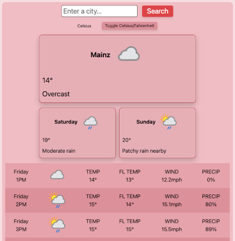

    

# Wetter App

## Einführung

Dieses Projekt ist eine Wetter App, die mit HTML, CSS und JavaScript entwickelt wurde. Sie ruft Wetterdaten von der WeatherAPI ab und zeigt aktuelle Wetterbedingungen, eine 3-Tage-Vorhersage und stündliche Wetteraktualisierungen für den Standort des Benutzers oder eine angegebene Stadt an.

## Projektbeschreibung

Die App bietet Benutzern aktuelle Wetterinformationen, einschließlich Temperatur, Wetterbedingungen, Windgeschwindigkeit, Niederschlagschance und mehr. Sie ermöglicht dynamisches Umschalten zwischen Celsius- und Fahrenheit-Einheiten und unterstützt Geolokalisierung für die automatische Wetterabfrage.

## Funktionen

- **Anzeige des aktuellen Wetters:** Zeigt aktuelle Temperatur, Wetterbedingung und Ort an.
- **2-Tage-Vorhersage:** Zeigt maximalen und minimalen Temperaturen sowie Wettericons für die nächsten zwei Tage an.
- **Stündliche Wettervorhersage:** Bietet detaillierte stündliche Wetteraktualisierungen, einschließlich Temperatur, "Gefühlte Temperatur", Windgeschwindigkeit und Niederschlagschance.
- **Einheitenumstellung:** Ermöglicht Benutzern das Umschalten zwischen Celsius- und Fahrenheit-Einheiten für die Anzeige der Temperatur.

## Live-Demo

- https://scaxcodes.github.io/odin-weather-app/

## Nutzung

- Gib den Namen einer Stadt in das Suchfeld ein und klicke auf "Suchen", um Wetterinformationen für diesen Ort zu erhalten.
- Wechsle zwischen Celsius und Fahrenheit, indem du auf den "Celsius/Fahrenheit umschalten" Button klickst.
- Sieh dir das aktuelle Wetter, die 3-Tage-Vorhersage und die stündlichen Wetteraktualisierungen an.

## Verbesserungen

- **Bessere Visualisierung der Wetterbedingungen:** Implementierung von Animationen oder visuellen Hinweisen basierend auf den Wetterbedingungen (z.B. Regenanimationen, sonniges Hintergrundbild).
- **Angepasste Anzeige für verschiedene Wetterbedingungen:** Zeige Wettericons und Daten interaktiver oder thematischer an, basierend auf der aktuellen Wetterlage (z.B. animierte Wolken für bewölktes Wetter).
- **Einfügen von weiteren Grafiken:** Die App könnte durch die Integration zusätzlicher Grafiken visuell noch ansprechender gestaltet werden.
- **Anzeigen von mehreren Tagen für die Vorhersage** Um eine längere Vorhersage anzeigen zu können, wäre eine kostenpflichtige Version der API erforderlich. Die derzeitige kostenlose Version ermöglicht nur eine Vorhersage von bis zu 2 Tagen.
- **Auslagern des API-Keys in einen Backend-Server:** Um den API-Key sicher zu halten, wäre es empfehlenswert, diesen in einem Backend-Server zu speichern. Obwohl dies für die aktuelle kostenlose API weniger problematisch ist, plane ich, dies zu tun, sobald ich fortgeschrittene Kenntnisse in Node.js erworben habe.

## Lizenz

- Dieses Projekt ist unter der MIT-Lizenz lizenziert.
